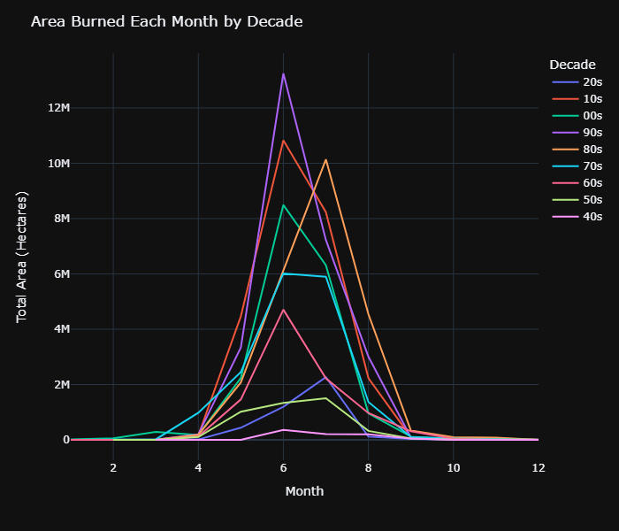

# Canadian Wildfires

## Goals
Thousands of wildfires burn across Canada every year, burning up millions of hectares of forest, altering ecosystems, displacing people and destroying communities. The smoke from fires affects our air quality, often impacting people living far from the fires themselves. The government spends hundreds of millions of dollars annually on fire prevention and suppression efforts. As the Canadian population grows, more people are living in areas that used to be wilderness, putting them closer to fires.

 

Understanding patterns in these fires and building accurate models to predict when, where and how big future fires will be is crucial to allocating resources and coordinating prevention efforts effectively. The goal of this project is to analyze historical data on Canadian wildfires and build a machine learning model able to predict the size of fires based on time, location, and weather data.

 

## Data
The wildfire data used in this was downloaded from Kaggle and can be found [here](https://www.kaggle.com/datasets/ulasozdemir/wildfires-in-canada-19502021).

 

Wildfire Data includes:
- FID: Fire ID
- SRC_AGENCY: Source agency from which the fire data was obtained.
- LATITUDE
- LONGITUDE
- REP_DATE: Date fire was reported by agency
- CAUSE: Cause of fire
- PROTZONE: Protection Zone
- ECOZONE: Ecodistrict associated with fire location

 

The weather data was collected from Open-Meteo's [Historical Weather API](https://open-meteo.com/en/docs/historical-weather-api). See the full citation at the bottom of this Readme. For each fire, I pulled the prior 2 weeks of daily weather data including
- Average Temperature
- High Temperature
- Total Precipitation
- Maximum Windspeed
- Dominant Wind Direction

 

## Process
1. Data Retrieval and Cleaning
    - From the wildfire data, rows were dropped if they were missing either location coordinates or a date. I mapped all points, then dropped those located outside of Canada. Some longitude coordinates needed to be flipped to negative (probably entered as E/W instead of +/-).
    - Weather data was collected through a series of API requests and saved to a MongoDB database. This had to be done in multiple batches over the week due to request limits and processes timing out. The weather_data_API_pulls notebook shows just one sample batch of API requests, but the rest were deleted for readability. After the series of requests, it was necessary to check for duplicates in the database due to batches overlapping.
2. EDA
    - EDA was a main focus of this project. I was interested in looking for patterns and trends in the wildfire data itself and how it related to the weather data. I produced a variety of charts and maps that can be seen in the two EDA notebooks. I created a Tableau Dashboard to provide an interacive platform to explore the data (linked below).

3. Modeling
I attempt a model that would predict the size of a fire. The feature set I used included:
    - Latitude
    - Longitude
    - Year
    - Month
    - Date
    - Cause
    - Elevation
    - 2 Week Rainfall (sum)
    - Avg High (from the preceding 2 weeks)
    - Start Date High
    - Avg Temp (from the preceding 2 weeks)
    - Start Date Wind Speed
    - Wind Direction

My initial modeling attempts used the average wind speed and direction from the preceding 2 weeks, but I found when I switched to just day-of wind conditions, I was able to reduce my RMSE by half.

After attempting multiple different algorithms and tweaking the feature set, I was only able to get an R2 value of .014. I decided to change my approach and split my modeling into two phases:
Phase 1 - Classification. First, I would predict if a fire would be small (0-15 hectares), medium (15-5,000 hectares) or large (5,000-1,050,000 hectares).
Phase 2 - Regression. Next, I trained three separate regression models to predict fire size for each one of the small, medium and large categories.
I tried out several different algorithms, but XGBoost seemed to perform best for both the classification and regression.

 

## Results
The Tableau Dashboard can be viewed [here](https://public.tableau.com/views/CanadianWildfires_16863712397540/Dashboard1?:language=en-US&:display_count=n&:origin=viz_share_link)

 

### Key observations:

Size Distribution:
- 75% of fires are 1 hectare or smaller
- 90% are under 15 hectares
- Only 1% of fires exceed 5,000 hectares

The highest number of fires start in July and August, but June is typically the worst month in terms of total area of fires.

  

The worst single year both in terms of number of fires and total area burned was 1989. Below is a map of fires that year with markers indicating the size of each fire.

The most number of fires are caused by humans, but lightning accounts for almost 85% of fires by area.

No strong patterns were found with the weather data and the fire size.
Below are heat density maps showing the distribution of high temperature and wind speed on the start date for small, medium and large fires. They show very similar distributions for all three sizes.

 

### Predictive Models
XGBoost performed best for both classification and regession models.

| Model | RMSE | R2 |
|-------|------|---------------|
| Small Fire Regressor | 1.970 | .102 | 
|Medium Fire Regressor | 888.0 | .087 |
|Large Fire Regressor  | 4,9176 | .012 |

 

## Challenges
Building accurate models with this dataset was very challenging. The data was incredibly skewed, with 75% of fires being only 1 hectare or smaller, 90% being under 15 hectaures, but the last 10% spanning from 15 to just over 1 million hectares in size. I considered removing outliers, but the most important fires are the biggest ones, so I did not want to remove the largest fires.

Another challenge I faced was with collecting the weather data. It took a long time to pull weather data for all 419,872 fires. I had to run this process in batches over about a week in order to get it all. While the weather data was trickling in, doing analysis and modeling with partial data was difficult because the data would be missing entire provinces or decades.

 

## Future Work
The feature set I built my models off of did not show any sort of strong correlation with fire size. To make these models more accurate, further research needs to be done and additional data collected that may bring in other relevant factors. The protection zones likely relate to how firefighters respond in putting out fires, but I was unable to associate the variety of different zones the different source agencies use. Other data to incorporate in future exploration would be things like fire prevention activities, provincial and federal budget allocations, and distances from fires to nearest population center or airport. Perhaps the size of a fire is more dependent on the human actions leading up to and following the fire than the weather conditions at the time of the fire. I could also expand the window for weather data, perhaps stretching it to look at the preceding month or season.

 

## Citations

Open-Meteo

Zippenfenig, P. (2023). Open-Meteo.com Weather API [Computer software]. Zenodo. https://doi.org/10.5281/ZENODO.7970649

Hersbach, H., Bell, B., Berrisford, P., Biavati, G., Horányi, A., Muñoz Sabater, J., Nicolas, J., Peubey, C., Radu, R., Rozum, I., Schepers, D., Simmons, A., Soci, C., Dee, D., Thépaut, J-N. (2023). ERA5 hourly data on single levels from 1940 to present [Data set]. ECMWF. https://doi.org/10.24381/cds.adbb2d47

Muñoz Sabater, J. (2019). ERA5-Land hourly data from 2001 to present [Data set]. ECMWF. https://doi.org/10.24381/CDS.E2161BAC

Schimanke S., Ridal M., Le Moigne P., Berggren L., Undén P., Randriamampianina R., Andrea U., Bazile E., Bertelsen A., Brousseau P., Dahlgren P., Edvinsson L., El Said A., Glinton M., Hopsch S., Isaksson L., Mladek R., Olsson E., Verrelle A., Wang Z.Q. (2021). CERRA sub-daily regional reanalysis data for Europe on single levels from 1984 to present [Data set]. ECMWF. https://doi.org/10.24381/CDS.622A565A